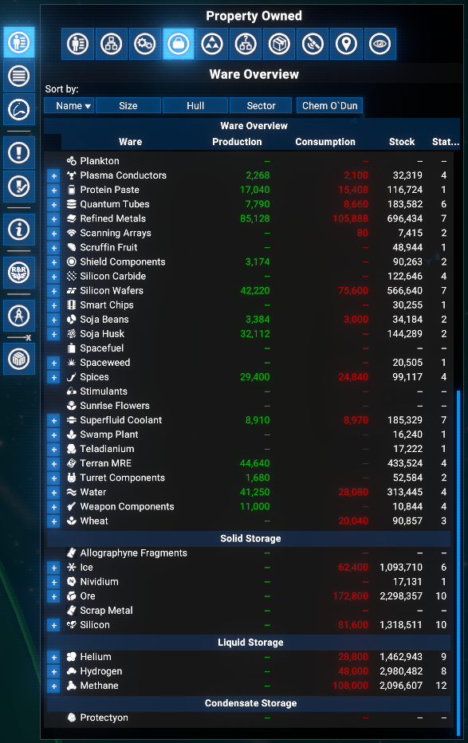
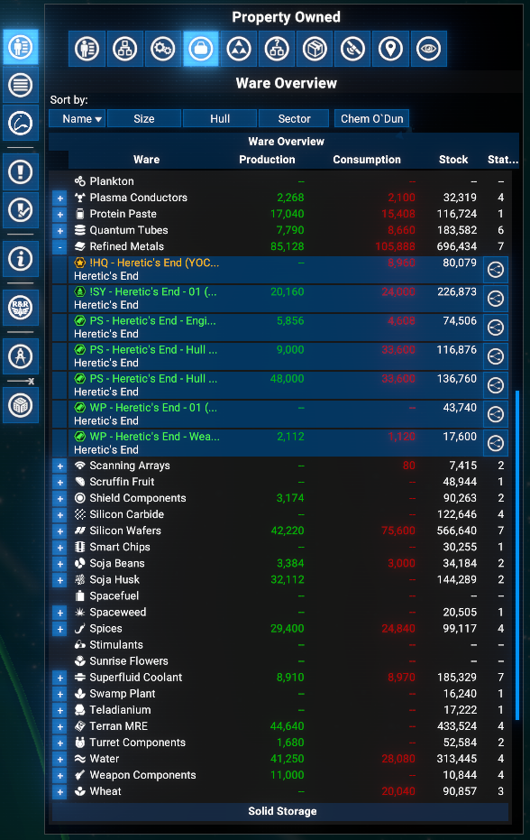
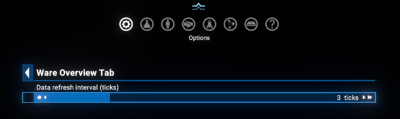

# Ware Overview Tab

Adds a **Ware Overview** tab to the **Property Owned** menu in the map. Lists all wares present at player-owned stations, grouped by transport type (Container, Solid, Liquid, Condensate), with total stock, production and consumption per hour, and station count. Each ware row is expandable to a per-station breakdown.

## Features

- **Ware Overview tab**: A dedicated tab in the Property Owned menu lists all wares that are stocked, produced, or consumed at player-owned stations.
- **Grouped by transport type**: Wares are organised under collapsible section headers: Container Storage, Solid Storage, Liquid Storage, and Condensate Storage.
- **Per-ware summary row**: Each ware shows a ware icon with name, total production per hour (green), total consumption per hour (red), total stock across all stations, and the number of stations that handle it.
- **Expandable to per-station detail**: Click the `+` button on a ware row to expand it and see a sub-row for each station that handles that ware. The sub-row shows the station name with sector below, per-station production/h, consumption/h, and current stock.
- **Logical Station Overview button**: Each station sub-row has a button to open the Logical Station Overview for that station.
- **Empty state**: If no wares are found at player stations, a clear message is shown.
- **Cached data**: Ware and station data are refreshed periodically to avoid redundant lookups every render.
- **Configurable refresh interval**: The data refresh interval (1-10 ticks, default 3) can be adjusted in **Extension options**.
- **Tab positioning**: The tab is placed after the **Production Stations** tab when that mod is also installed, otherwise after the **Stations** tab.
- **Compatible with X4 8.00 and 9.00 beta**.

## Requirements

- **X4: Foundations**: Version **8.00HF4** or higher and **UI Extensions and HUD**: Version **v8.0.4.x** or higher by [kuertee](https://next.nexusmods.com/profile/kuertee?gameId=2659):
  - Available on Nexus Mods: [UI Extensions and HUD](https://www.nexusmods.com/x4foundations/mods/552)
- **X4: Foundations**: Version **9.00** or higher and **UI Extensions and HUD**: Version **v9.0.0.5** or higher by [kuertee](https://next.nexusmods.com/profile/kuertee?gameId=2659).
- **Mod Support APIs**: Version 1.95 or higher by [SirNukes](https://next.nexusmods.com/profile/sirnukes?gameId=2659):
  - Available on Steam: [SirNukes Mod Support APIs](https://steamcommunity.com/sharedfiles/filedetails/?id=2042901274)
  - Available on Nexus Mods: [Mod Support APIs](https://www.nexusmods.com/x4foundations/mods/503).

## Installation

- **Steam Workshop**: [Ware Overview Tab](https://steamcommunity.com/sharedfiles/filedetails/?id=3712869644) - only for **Game version 9.00** with latest Steam version of the `UI Extensions and HUD` mod.
- **Nexus Mods**: [Ware Overview Tab](https://www.nexusmods.com/x4foundations/mods/2079)

## Usage

Open the map, switch to the **Property Owned** panel, and click the **Ware Overview** tab in the tab strip.

All wares present at player-owned stations are listed, grouped by transport type. Each group has a section header that can be collapsed.

### Ware row

Each ware row contains:

- **+/-** expand button on the left (only shown when at least one station handles the ware).
- Ware icon and name.
- Total production per hour (shown in green).
- Total consumption per hour (shown in red).
- Total stock across all player stations.
- Number of player stations handling this ware (`--` when none).

### Station sub-row

Click `+` on a ware row to expand it. Each station that handles the ware gets a sub-row:

- Station name with sector shown below it.
- Per-station production per hour (green) and consumption per hour (red).
- Current stock at that station.
- **Logical Station Overview** button to open the station inventory and build plan.

### Extension options

**Options Menu > Extension options > Ware Overview Tab**:

- **Data refresh interval** (1-10, default 3): Number of UI ticks between data refreshes. Lower values keep station and ware data more up to date; higher values reduce CPU usage.

## Credits

- **Author**: Chem O`Dun, on [Nexus Mods](https://next.nexusmods.com/profile/ChemODun/mods?gameId=2659) and [Steam Workshop](https://steamcommunity.com/id/chemodun/myworkshopfiles/?appid=392160)
- *"X4: Foundations"* is a trademark of [Egosoft](https://www.egosoft.com).

## Acknowledgements

- [EGOSOFT](https://www.egosoft.com) - for the X series.
- [kuertee](https://next.nexusmods.com/profile/kuertee?gameId=2659) - for the `UI Extensions and HUD` that makes this extension possible.
- [SirNukes](https://next.nexusmods.com/profile/sirnukes?gameId=2659) - for the `Mod Support APIs` that power the UI hooks and options menu.

## Changelog

### [8.00.02] - 2026-06-27

- **Changed**
  - On Steam: restricted to game version 9.0 or higher

### [8.00.01] - 2026-04-24

- **Added**
  - Initial public version.
